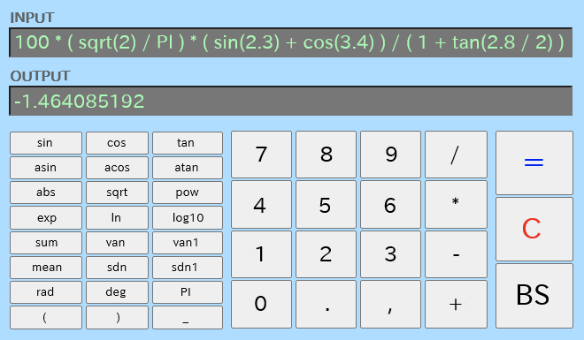
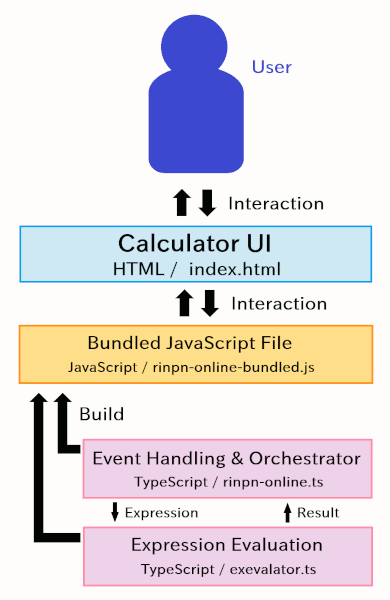

# RINPn Online

( &raquo; [Japanese](./README_JAPANESE.md) )

Simplified web version of [RINPn](https://github.com/RINEARN/rinpn), a scientific calculator.

## How to Use

To use RINPn right now in your browser, visit the [official RINPn website](https://www.rinearn.com/en-us/rinpn/) and click "**Open Online**." This will always launch the latest version.

If you prefer to download this repository and run it locally, please **be sure to extract (unzip) the ZIP archive first (important).** After extraction, open the following HTML file in your web browser (double-clicking it is fine):

    English/index.html

The calculator will appear inside your browser.

If you plan to use RINPn regularly on your local machine, we recommend the desktop version instead of the online version. It offers more features, while the online version is significantly limited: [https://github.com/RINEARN/rinpn](https://github.com/RINEARN/rinpn)

## How to Build

This app is open-source software. You can obtain the source code and build it as follows:

    # Download the source code
    git clone https://github.com/RINEARN/rinpn-online.git

    # Change to the app directory
    cd ./rinpn-online/English

    # Set up the environment
    npm init   # Only when "package.json" is not initialized yet
    npm install --save-dev typescript
    npm install --save-dev @types/node 
    npm install --save-dev esbuild

    # Build
    npx esbuild rinpn-online.ts --bundle --outfile=rinpn-online-bundled.js

When the build completes successfully, a single JavaScript file, `rinpn-online-bundled.js`, is generated. The file is loaded by `index.html`.

Then, just open `index.html` in your browser to run the app.

## Architecture

The basic architecture of RINPn Online is very simple. The core structure is just three files:

* A single HTML file for the UI ( index.html )
* A TypeScript library that performs expression evaluation ( exevalator.ts )
* A TypeScript file that handles UI events and bridges them to the evaluator ( rinpn-online.ts )

Visualized, the architecture looks like this:

For details, see the following article:

* [Inside RINPn Online: Architecture Overview](https://www.rinearn.com/en-us/info/news/2025/1022-rinpn-online-architecture)

## License

* RINPn Online: MIT License

Dependencies: 

* [Exevalator](https://github.com/RINEARN/exevalator) (an expression-calculator library): Unlicense

## About Us

The RINPn and the RINPn Online are developed by a Japanese software development studio: [RINEARN](https://www.rinearn.com/). The author is Fumihiro Matsui.

Please feel free to contact us if you have any questions, feedback, or other comments.

