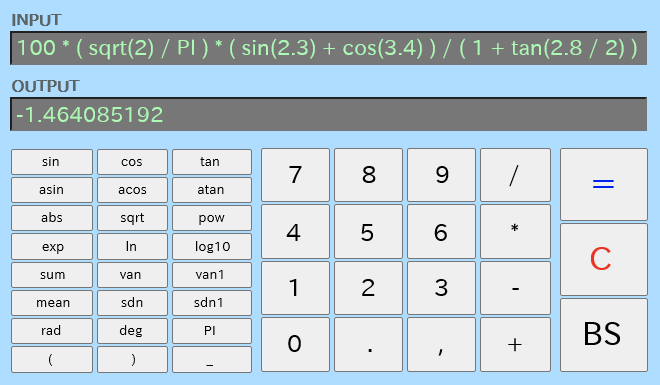

# RINPn オンライン版

( &raquo; [English](./README.md) )

関数電卓 [RINPn (りんぷん)](https://github.com/RINEARN/rinpn) の、ブラウザ上でも利用可能な簡易版です。

## 使い方

この場で今すぐ使うには、[RINPn公式サイト](https://www.rinearn.com/ja-jp/rinpn/) に移動し、「オンライン版を起動」ボタンをクリックしてください。すると常に最新版が起動します。

このリポジトリをダウンロードして、ローカルで起動したい場合は、まずダウンロード後に、**必ずZIPファイルを展開してください（重要）**。展開完了後、以下のHTMLファイルをWebブラウザで開きます（普通にダブルクリックすると開けます）：

    Japanese/index.html

すると、ブラウザの画面内に電卓が表示されます。

なお、ローカルで常用したい場合には、このオンライン版ではなく、[普通のフル機能版](https://github.com/RINEARN/rinpn) の方が高機能なのでおすすめです。オンライン版はかなり機能が削られています。

## ビルド方法

このアプリはオープンソースです。
以下のようにソースコードを入手・ビルドできます：

    # ソースコードを入手
    git clone https://github.com/RINEARN/rinpn-online.git

    # アプリのフォルダ内に移動
    cd ./rinpn-online/Japanese

    # 環境構築
    npm init   # "package.json" をまだ初期化していない場合のみ
    npm install --save-dev typescript
    npm install --save-dev @types/node 
    npm install --save-dev esbuild

    # ビルド
    npx esbuild rinpn-online.ts --bundle --outfile=rinpn-online-bundled.js

全てのビルド手順が正常に完了すると、一枚化されたJavaScriptファイル「rinpn-online-bundled.js」が生成されます。このファイルは index.html から読み込まれます。

あとは、普通に index.html をブラウザで開くと動きます。

## ライセンス

* RINPnオンライン版の本体: MIT License

依存ライブラリ: 

* [Exevalator](https://github.com/RINEARN/exevalator) (数式計算ライブラリ): Unlicense

## 開発元について

RINPn や RINPn オンライン版は、日本の個人運営の開発スタジオ [RINEARN](https://www.rinearn.com/) が開発しています。著者は松井文宏です。ご質問やフィードバックなどをお持ちの方は、ぜひ御気軽にどうぞ！

